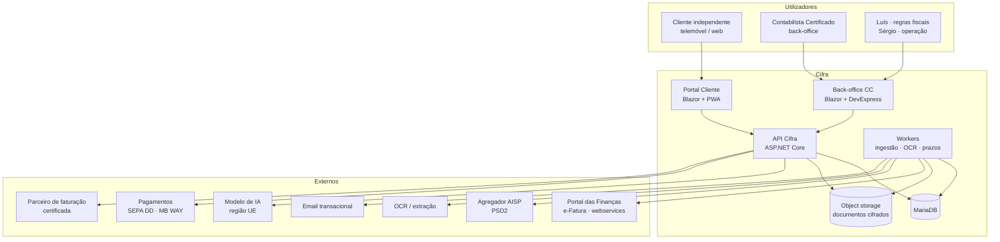
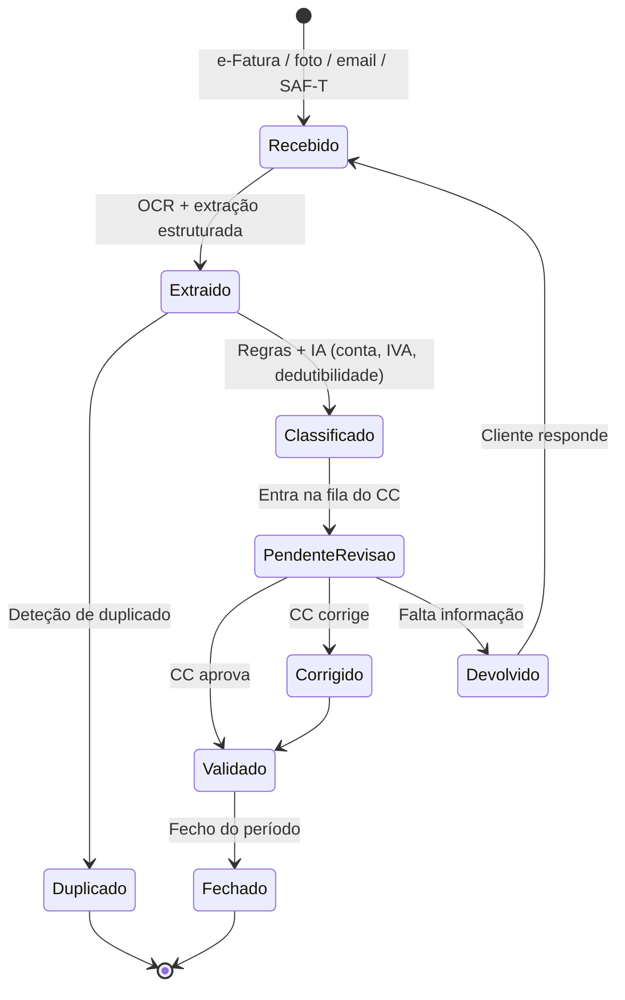

# 03 · Arquitetura

## 1. Princípios

1. **Monólito modular, não microserviços.** Com uma equipa de 2–3 developers, microserviços
   custam mais do que rendem. Módulos com fronteiras explícitas dentro de uma solução .NET,
   preparados para extração posterior se e quando fizer sentido.
2. **A base de dados é o guardião do isolamento.** O `tenant_id` é validado nas *stored
   procedures*, não apenas na camada C#. Uma falha de autorização em C# não deve conseguir
   ler dados de outro cliente.
3. **Nada é definitivo sem revisão humana.** O estado "validado" só é atingível por ação de
   um utilizador com perfil CC. É invariante de domínio.
4. **Tudo o que a IA produz é rastreável.** *Prompt*, contexto, resposta, versão do modelo e
   versão da base de conhecimento ficam registados e associados ao lançamento.
5. **A API é a única porta para os dados.** Portal web, PWA e futura app móvel consomem a
   mesma API, com as mesmas regras de autorização.
6. **Fontes de dados são substituíveis.** e-Fatura, banca, OCR e modelo de IA estão atrás de
   interfaces; nenhum deles pode ser um acoplamento estrutural.

---

## 2. Contexto do sistema



---

## 3. Stack

| Camada | Escolha | Justificação |
|---|---|---|
| Runtime | **.NET 10 (LTS)** | Suporte longo, alinhado com a experiência da equipa |
| UI cliente | **Blazor Web App**, render mode `InteractiveAuto` + **PWA** | SSR para o primeiro carregamento e SEO da parte pública; WebAssembly para captura de fatura e tolerância a rede fraca no telemóvel |
| UI back-office | **Blazor Server (`InteractiveServer`) + DevExpress Blazor** | Grelhas densas, filtros e relatórios; rede fiável (escritório); alinhado com a *stack* existente da equipa |
| API | **ASP.NET Core** (controllers + Minimal APIs para *webhooks*) | Versionada, OpenAPI, uma única fonte de autorização |
| Acesso a dados | **Dapper + stored procedures MariaDB** | Convenção da casa; a lógica de dados vive na BD, o C# orquestra |
| Base de dados | **MariaDB 11.4 LTS** | Requisito; `InnoDB`, `utf8mb4`, replicação assíncrona para réplica de leitura/DR |
| Trabalhos assíncronos | **`BackgroundService` + tabela de *outbox*/fila em MariaDB** | Evita mais uma peça de infraestrutura no arranque; migrar para RabbitMQ se o volume justificar |
| Autenticação | **OIDC com Duende IdentityServer ou Keycloak**, cookies para o Blazor, JWT para a API | 2FA obrigatório para CC e administradores; opcional mas incentivado para clientes |
| Ficheiros | **Object storage compatível com S3, em região UE**, cifra do lado do servidor + envelope por *tenant* | Documentos nunca no sistema de ficheiros da aplicação |
| Observabilidade | **Serilog + OpenTelemetry → Grafana/Loki/Tempo** ou Seq | Correlação por `trace_id` de ponta a ponta |
| Validação | **FluentValidation** | Na camada de serviço, nunca só na UI |
| Contentores | **Docker em Ubuntu Server** | Convenção da casa |

> **Nota sobre Blazor Server no telemóvel.** Blazor Server puro depende de uma ligação
> SignalR persistente. Para um utilizador a fotografar uma fatura na rua, isso traduz-se em
> reconexões e perda de estado. Daí a separação: **cliente em `InteractiveAuto`/PWA**,
> **back-office em `InteractiveServer`**. É a decisão de arquitetura com maior impacto na
> experiência prometida na página.

---

## 4. Módulos

```
Cifra.sln
├── src/
│   ├── Cifra.Api                 → Endpoints REST, autenticação, autorização, rate limiting
│   ├── Cifra.Portal              → Blazor Web App (cliente) + PWA
│   ├── Cifra.BackOffice          → Blazor Server + DevExpress (CC e administração)
│   ├── Cifra.Workers             → Ingestão, OCR, prazos, notificações, expurgo de retenção
│   ├── Cifra.Application         → Serviços de caso de uso, DTOs, validadores, interfaces
│   ├── Cifra.Domain              → Entidades, enums, máquinas de estado, invariantes
│   ├── Cifra.Infrastructure      → Repositórios Dapper, integrações, cifra, storage
│   ├── Cifra.Assistant           → RAG, política de encaminhamento, avaliação, registo de IA
│   └── Cifra.Shared              → Constantes, extensões, tipos transversais
├── db/
│   ├── migrations/               → Migrações versionadas e idempotentes
│   ├── procedures/               → Uma stored procedure por ficheiro, versionada
│   └── seed/                     → Planos de contas, CAEs, taxas, calendário de obrigações
└── tests/
    ├── Cifra.UnitTests
    ├── Cifra.IntegrationTests    → Testcontainers com MariaDB real
    ├── Cifra.SecurityTests       → Testes de isolamento multi-tenant e de autorização
    └── Cifra.Assistant.Evals     → Conjunto dourado de perguntas fiscais
```

### Módulos funcionais

| Módulo | Responsabilidade |
|---|---|
| **Identidade & Acesso** | Utilizadores, perfis (cliente, CC, apoio, administrador), 2FA, sessões, delegações |
| **Clientes** | Ficha do cliente, enquadramento fiscal (CAE, regime de IVA e de IRS, periodicidade), contrato, CC responsável |
| **KYC/AML** | Identificação, verificação, decisão de aceitação ou recusa, conservação, sinalizações |
| **Ingestão** | Ligações e-Fatura, carregamento manual, email dedicado, SAF-T, extratos bancários; deduplicação |
| **Documentos** | Cofre cifrado, OCR, extração estruturada, versões, ligação ao lançamento |
| **Classificação** | Proposta de conta, taxa e dedutibilidade de IVA em função do CAE e do regime; regras + IA |
| **Livro / Lançamentos** | Máquina de estados do lançamento, períodos, fecho, correções |
| **Revisão** | Fila do CC ordenada por risco e prazo, aprovação em lote, correções, medição de tempo |
| **Obrigações** | Motor de regras com vigência temporal, geração de tarefas, alertas, estado de cumprimento |
| **Assistente** | RAG sobre corpus fiscal versionado, citações obrigatórias, triagem de risco, escalada |
| **Comunicação** | Conversa cliente ↔ assistente ↔ CC, notificações, email, *push* |
| **Faturação da Cifra** | Subscrições, planos, cobranças SEPA/MB WAY, emissão via parceiro certificado |
| **Auditoria** | Registo imutável encadeado de todos os eventos com relevância legal |
| **Privacidade** | Pedidos de acesso, portabilidade, apagamento parcial, consentimentos, execução da retenção |

---

## 5. Camada de IA — desenho e salvaguardas

### 5.1 Arquitetura RAG com versão temporal

O erro mais grave que um assistente fiscal pode cometer é **responder com a regra errada
para o ano errado**. As taxas, limites e coeficientes mudam anualmente. Por isso o corpus
não é um índice plano: cada excerto tem **vigência** (`vigente_de`, `vigente_ate`), e a
consulta filtra sempre pela data do facto tributário em causa, não pela data de hoje.

```mermaid
sequenceDiagram
    participant C as Cliente
    participant A as Assistente
    participant T as Triagem de risco
    participant R as Índice fiscal<br/>(com vigência)
    participant M as Modelo (UE)
    participant Q as Fila do CC
    participant CC as Contabilista

    C->>A: Pergunta
    A->>T: Classificar risco + tema
    alt Risco elevado (planeamento, inspeção, litígio)
        T->>Q: Encaminhar diretamente
        A-->>C: "Esta questão vai direta ao Carlos"
    else Risco normal
        T->>R: Recuperar excertos (CAE, regime, data do facto)
        R-->>A: Excertos + referências
        A->>M: Contexto + pergunta + regras de resposta
        M-->>A: Resposta com citações
        A->>A: Validar citações e confiança
        alt Confiança suficiente
            A-->>C: Resposta + citações + aviso de orientação preliminar
            A->>Q: Registar para amostragem de qualidade
        else Confiança insuficiente
            A->>Q: Encaminhar com rascunho
            A-->>C: "Preparei uma resposta; o Carlos confirma até 24 h"
        end
    end
    CC->>C: Validação ou correção
```

### 5.2 Regras rígidas

| Regra | Porquê |
|---|---|
| Toda a afirmação normativa tem de citar fonte do corpus | Sem citação, não há resposta — devolve encaminhamento |
| O modelo **não tem ferramentas de escrita** para a AT nem para o livro | A submissão é sempre ato humano |
| Corpus curado e versionado, nunca a web aberta | Determinismo e defensabilidade |
| Dados pessoais minimizados no *prompt* | Enviar CAE, regime e valores; não enviar NIF, nome ou IBAN salvo necessidade |
| Fornecedor de modelo com DPA e processamento em região UE | Promessa explícita da página |
| Registo integral de cada interação, com versão do modelo e do corpus | Auditoria, AI Act, resolução de reclamações |
| Amostragem de 5–10 % das respostas automáticas para revisão do CC | Qualidade medida, não presumida |

### 5.3 Níveis de encaminhamento

| Nível | Exemplos | Comportamento |
|---|---|---|
| **A — Automático** | "Posso deduzir o IVA deste monitor?", "Quando entrego o IVA?", "O que é o ATCUD?" | Resposta imediata com citação; amostragem para revisão |
| **B — Assistido** | Classificação de despesa ambígua, afetação mista, enquadramento de nova atividade | Resposta com aviso + entrada na fila do CC |
| **C — Sempre humano** | Planeamento fiscal, inspeção ou notificação da AT, cessação de atividade, imobiliário, cripto, herança, litígio, mudança de regime | Nunca responde substantivamente; encaminha e informa o cliente |

### 5.4 Avaliação contínua

Construir, com o Luís e o Carlos, um **conjunto dourado de 200–300 perguntas reais** com
resposta validada e referência normativa. Executar em cada *pull request* que toque no
assistente, no corpus ou nos *prompts*. Métricas: exatidão factual, presença e correção da
citação, taxa de encaminhamento indevido (falso automático) e taxa de encaminhamento
excessivo (que destrói a margem). **Nenhuma alteração ao assistente entra em produção sem
esta bateria verde.** É o teste de regressão mais importante do sistema.

---

## 6. Integrações

| Integração | Mecanismo | Notas de risco |
|---|---|---|
| **e-Fatura (leitura)** | Sub-utilizador delegado ao CC; descarga periódica do ficheiro de faturas / SAF-T | Sem contrato de API: assumir que pode quebrar. Monitorizar taxa de sucesso por cliente e alertar operacionalmente. Fila de reprocessamento e alternativa manual sempre disponível |
| **AT (webservices)** | SOAP com certificado de cliente + credenciais de sub-utilizador | Apenas se e quando a Cifra comunicar séries ou faturas emitidas |
| **Banca (PSD2)** | Agregador AISP | Consentimento com validade limitada; fluxo de renovação obrigatório no produto |
| **OCR / extração** | Serviço em região UE, atrás de `IDocumentExtractor` | Guardar sempre o original; a extração é reprocessável |
| **Faturação certificada** | API do parceiro | Não construir. Ver [02 §2.3](02-analise-regulatoria.md#23-faturação-certificada--não-construir) |
| **Pagamentos** | Débito direto SEPA + MB WAY (Ifthenpay/Easypay) ou Stripe | MB WAY é praticamente obrigatório no mercado português |
| **Email e *push*** | Fornecedor em região UE | Nunca incluir dados fiscais no corpo do email; apenas notificação e ligação ao portal |

**Padrão comum a todas:** cliente com *retry* e recuo exponencial, disjuntor (Polly),
idempotência por chave de negócio, e registo do pedido/resposta sem dados pessoais em claro.

---

## 7. Fluxo principal — da fatura ao lançamento validado



Duas notas essenciais:

- A transição para `Validado` exige `perfil = CC` e escreve na cadeia de auditoria. É
  garantida na *stored procedure*, não só no serviço.
- Cada correção do CC alimenta o conjunto de treino de regras de classificação. Ao fim de
  alguns meses, isto é o que reduz o tempo de revisão — e portanto o que sustenta a margem.

---

## 8. Implantação

```
Internet
   │  TLS 1.3
   ▼
[ Reverse proxy / WAF ]   ← Caddy ou Nginx + ModSecurity/CrowdSec
   ├── portal.cifra.pt   → Cifra.Portal   (contentor, 2 réplicas)
   ├── app.cifra.pt      → Cifra.BackOffice (contentor, rede restrita por IP)
   └── api.cifra.pt      → Cifra.Api      (contentor, 2 réplicas)
                                │
                         [ rede interna ]
                                │
              ┌─────────────────┼─────────────────┐
        Cifra.Workers      MariaDB primária    Object storage (UE)
                            │
                     MariaDB réplica (DR, outra AZ)
```

- **Alojamento em região UE** com contrato e DPA (OVHcloud, Hetzner ou Azure West Europe).
  A escolha entre autogerido e gerido é um compromisso entre custo e carga operacional —
  ver [07](07-roadmap-equipa-custos.md).
- **Ambientes:** `dev` → `staging` (com dados sintéticos, nunca produção) → `prod`.
- **Cópias de segurança:** completa diária + binlog contínuo; cópia cifrada fora do local;
  **teste de restauro mensal, com resultado registado**. Uma cópia nunca testada não é cópia.
- **Objetivos de recuperação:** RPO ≤ 15 min, RTO ≤ 4 h. Justificam-se: perder um dia de
  trabalho em época de IVA é inaceitável.
