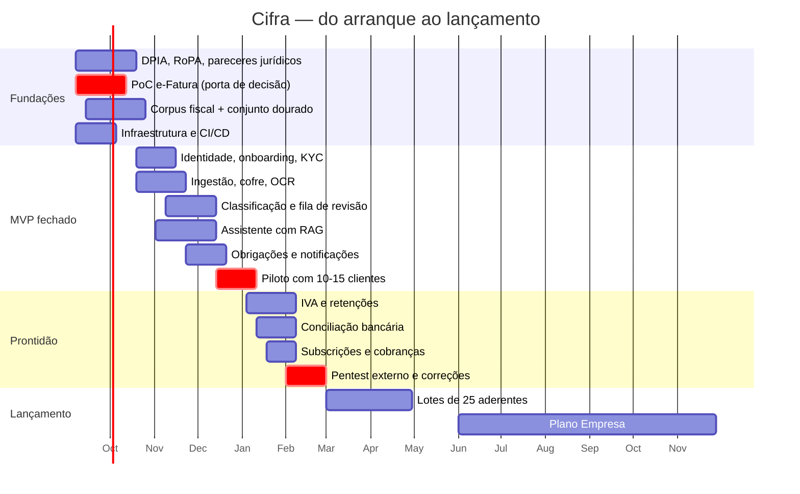

# 07 · Roadmap, equipa e custos

## 1. Restrição de partida

De setembro de 2026 ao lançamento no início de 2027 há **cerca de cinco meses úteis**.
Não chegam para tudo o que a página anuncia. O plano abaixo protege três coisas, por esta
ordem: **(1) conformidade legal**, **(2) o fluxo nuclear fatura → lançamento validado**,
**(3) a promessa de prazos**. Tudo o resto é negociável.

Um lançamento com o plano Start bem feito e o Pro em beta fechado é melhor do que três
planos meio feitos — sobretudo num negócio cujo produto é a confiança.

## 2. Fases

### Fase 0 · Fundações (set–out 2026, 6 semanas)

Trabalho que não produz ecrãs mas sem o qual não se pode lançar.

| Entrega | Responsável |
|---|---|
| **DPIA** e registo de atividades de tratamento (RoPA) | Sérgio + jurista |
| Política de privacidade, termos e condições, política de uso justo | Luís + jurista |
| Parecer jurídico sobre âmbito NIS2/DL 125/2025 e sobre AI Act | Jurista |
| Procedimento AML: identificação, recusa, conservação, formação | Carlos |
| **Prova de conceito da delegação e-Fatura** com 3 clientes reais | Sérgio + Carlos |
| Seleção do agregador PSD2 (cobertura, preço, DPA) | Sérgio |
| Seleção do parceiro de faturação certificada | Luís |
| Decisão de alojamento em região UE + DPAs assinados | Sérgio |
| Esqueleto da solução, CI/CD, MariaDB, ambientes, observabilidade | Sérgio |
| Corpus fiscal v1: 150 excertos aprovados para os 10 CAEs prioritários | Luís + Carlos |
| Conjunto dourado v1: 200 perguntas com resposta validada | Luís + Carlos |
| Consentimento e privacidade da lista de espera revistos | Sérgio |

> **Porta de saída da Fase 0.** Se a prova de conceito do e-Fatura falhar, o produto muda:
> passa a assentar em carregamento manual e SAF-T, o que altera a proposta de valor
> ("nem isso" deixa de ser verdade) e o preço. **Esta é a decisão mais importante do
> projeto e tem de ser tomada em outubro, não em janeiro.**

### Fase 1 · MVP fechado (out–dez 2026, 10 semanas)

Objetivo: 10–15 clientes reais da carteira do Luís e do Carlos a usar o produto a sério.

- Identidade e acesso, 2FA, perfis
- *Onboarding* com KYC e enquadramento fiscal
- Ingestão: e-Fatura (delegação), carregamento manual, email dedicado
- Cofre documental cifrado; OCR e extração
- Classificação por regras + IA, com confiança
- **Fila de revisão do CC** com aprovação em lote e atalhos de teclado
- Assistente com RAG, citações obrigatórias e triagem de risco em três níveis
- Motor de obrigações e notificações
- Portal do cliente (PWA) com os ecrãs descritos em [06 §2](06-frontend-ux.md#2-portal-do-cliente)
- Cadeia de auditoria e registo de IA
- Testes de isolamento multi-tenant em CI

**Não entra:** IVA, conciliação bancária, faturação, cobranças, plano Empresa.

### Fase 2 · Prontidão comercial (jan–fev 2027, 8 semanas)

- Declaração periódica de IVA e retenções na fonte (preparação e mapas; entrega pelo CC)
- Conciliação bancária via agregador PSD2, com fluxo de re-consentimento
- Subscrições e cobranças (SEPA + MB WAY), emissão das faturas da Cifra
- Integração com o parceiro de faturação
- Módulo de privacidade: exportação, apagamento parcial, gestão de consentimentos
- **Pentest externo** e correção de constatações altas e críticas
- Manuais de resposta a incidentes e primeiro exercício
- Restauro de cópia de segurança testado e cronometrado
- Migração dos clientes-piloto e correções resultantes

### Fase 3 · Lançamento (mar 2027)

- Abertura da lista de espera por ordem de inscrição, em lotes de 25
- Planos Start e Pro em produção
- Painel operacional: deflexão, tempo do CC, ligações partidas, prazos em risco
- Suporte de 1.ª linha com base de conhecimento

> **Lotes, não abertura geral.** A capacidade do CC é o limite físico do negócio. Abrir a
> todos ao mesmo tempo destrói a promessa de 24 h logo na primeira semana e, com ela, o
> ativo mais valioso da Cifra.

### Fase 4 · Consolidação e Empresa (abr–dez 2027)

- Aprendizagem das correções do CC (redução do tempo de revisão)
- Segundo CC e ferramentas de gestão de carteira
- Preparação do plano Empresa: IRC, IES, dossier fiscal, processamento salarial
- Preparação para certificação ISO/IEC 27001, se os clientes B2B a exigirem

## 3. Cronograma

## 4. Equipa

| Papel | Quem | Dedicação | Notas |
|---|---|---|---|
| Tecnologia / arquitetura | **Sérgio** | 100 % | Não pode ser simultaneamente arquiteto, developer único, DevOps e responsável de segurança |
| Developer .NET sénior | **a contratar** | 100 % | **Contratação crítica.** Sem ele o calendário não fecha |
| Front-end / UX | a contratar ou freelance | 50 % | Portal do cliente é onde se ganha ou perde a adesão |
| DevOps / segurança | freelance | 25 % | Infraestrutura, *hardening*, observabilidade, apoio ao pentest |
| Regras fiscais e conteúdo | **Luís** | 60 % | Dono do corpus, dos *prompts* e do conjunto dourado |
| Contabilista responsável | **Carlos** | 60 % → 100 % | Valida, define o fluxo de revisão, responde |
| Jurídico (RGPD/NIS2/AI Act) | externo | pontual | Fase 0 e revisão pré-lançamento |
| Pentest | externo | pontual | Fase 2 |
| Apoio de 1.ª linha | a contratar | 50 % a partir do lançamento | |

**A recomendação mais importante desta secção:** contratar o segundo developer em setembro.
É o único risco de calendário que não se pode mitigar com âmbito.

## 5. Custos indicativos

### Desenvolvimento (set 2026 – mar 2027, 7 meses)

| Rubrica | Estimativa |
|---|---|
| Developer .NET sénior (7 meses) | 28 000 – 38 500 € |
| Front-end/UX a 50 % (5 meses) | 10 000 – 15 000 € |
| DevOps/segurança a 25 % (5 meses) | 6 000 – 9 000 € |
| Jurídico (DPIA, pareceres, contratos) | 5 000 – 9 000 € |
| Pentest externo | 5 000 – 9 000 € |
| Licenças DevExpress (universal, 1 developer) | ~2 000 € |
| Infraestrutura e serviços em pré-produção | 2 500 – 4 000 € |
| Marca, conteúdo e materiais de lançamento | 3 000 – 6 000 € |
| **Total antes do lançamento** | **~62 000 – 92 500 €** |

Não inclui o tempo dos três sócios, que se assume como aporte.

### Operação recorrente (a 25 clientes — piloto e primeiro lote)

Este é o cenário real dos primeiros meses: dezembro de 2026 (piloto, sem receita) e março
de 2027 (primeiro lote de 25 aderentes). Duas colunas, porque a escolha é genuína:
**mínimo** é o que basta para operar com segurança aceitável durante o piloto; **recomendado**
é o que se deve ter no dia em que existe o primeiro cliente pagante.

#### Alojamento

Base: Hetzner ou OVHcloud, região UE, Docker em Ubuntu Server — coerente com a *stack* da
equipa. Valores mensais, com IVA à parte.

| Componente | Especificação | Mínimo | Recomendado |
|---|---|---|---|
| Servidor de aplicação + workers | 4 vCPU, 8 GB RAM, 160 GB NVMe | 16 € | 16 € |
| Servidor de base de dados MariaDB | 4 vCPU, 8 GB RAM, 160 GB NVMe, disco dedicado | 16 € | 16 € |
| Réplica MariaDB (recuperação de desastre) | 2 vCPU, 4 GB, noutra zona | — | 8 € |
| Ambiente de *staging* | 2 vCPU, 4 GB, desligável fora de horas | 5 € | 8 € |
| Balanceador de carga gerido | Necessário para implantações sem interrupção | — | 6 € |
| **Subtotal alojamento** | | **37 €** | **54 €** |

Notas:

- **A base de dados nunca partilha máquina com a aplicação**, nem sequer no piloto. É
  separação de contenção, não de desempenho: um comprometimento da aplicação não deve dar
  acesso direto ao motor de base de dados.
- A **réplica não é opcional a partir do primeiro cliente pagante**. Custa 8 €/mês e é o
  que torna credível o objetivo de RTO ≤ 4 h; sem ela, uma falha do servidor primário em
  época de IVA é uma reposição a partir de cópia, com horas de indisponibilidade.
- Alternativa gerida, se o tempo do Sérgio valer mais do que a diferença: MariaDB gerida na
  OVH Public Cloud Databases custa 25–40 €/mês; Azure Database for MySQL fica em 60–80 €/mês.
  Ambas eliminam trabalho de manutenção e correção de segurança do motor.

#### Domínio, DNS e correio

| Componente | Detalhe | Mínimo | Recomendado |
|---|---|---|---|
| `cifra.pt` | Registo/renovação, ~20–30 €/ano | 2 € | 2 € |
| `cifra.com` (defensivo) | ~12 €/ano | — | 1 € |
| DNS gerido | Cloudflare Free ou plano pago | — | 5 € |
| Certificados TLS | Let's Encrypt, incluindo *wildcard* | 0 € | 0 € |
| Correio profissional | Google Workspace ou Microsoft 365, 4 caixas | 25 € | 28 € |
| Email transacional | Brevo/Postmark, fornecedor em região UE | 0 € | 15 € |
| **Subtotal domínio e correio** | | **27 €** | **51 €** |

Três notas práticas que valem mais do que o custo:

- **Registar `cifra.pt` já, antes de qualquer comunicação pública**, com renovação
  automática e bloqueio de transferência ativos. O domínio é o único ativo desta lista que
  não se pode recomprar por 20 € depois de alguém o registar.
- O **email transacional tem de ser um fornecedor com processamento na UE** e com DPA
  assinado, como o resto da cadeia. E nenhuma mensagem leva dados fiscais no corpo: só
  notificação e ligação ao portal.
- Configurar **SPF, DKIM e DMARC em modo `reject`** desde o primeiro dia. Um serviço de
  contabilidade é um alvo óbvio de fraude por email em nome da marca.

#### Cópias de segurança

| Componente | Detalhe | Mínimo | Recomendado |
|---|---|---|---|
| *Snapshots* automáticos dos servidores | +20 % do custo do servidor, no fornecedor | 7 € | 11 € |
| Espaço de cópias (1 TB) | Cópia completa diária + *binlog* contínuo | 4 € | 4 € |
| **Cópia fora do fornecedor**, cifrada | ~100 GB noutro fornecedor e outra jurisdição UE | — | 6 € |
| Object storage dos documentos | Escalão mínimo do fornecedor | 6 € | 6 € |
| Ferramenta de cópia e restauro | restic ou borg, auto-alojado | 0 € | 0 € |
| **Subtotal cópias de segurança** | | **17 €** | **27 €** |

O dimensionamento é contra-intuitivo e vale a pena registá-lo: 25 clientes geram cerca de
**2,5 GB de documentos por ano** (≈ 250 documentos por cliente, ~400 KB cada). Mesmo a 500
clientes são ~50 GB/ano. **O custo de armazenamento é inteiramente determinado pelo escalão
mínimo do fornecedor, não pelo volume** — pelo que não há qualquer razão para poupar aqui.

Política de retenção a aplicar desde o piloto: 30 cópias diárias, 12 mensais, cifradas com
chave **distinta da produção** e guardadas em local separado. E a regra que torna tudo isto
real: **restauro completo testado e cronometrado uma vez por mês, com resultado registado**.
Uma cópia nunca testada não é uma cópia.

#### Restantes serviços a 25 clientes

| Rubrica | Mínimo | Recomendado |
|---|---|---|
| Inferência de IA (assistente, triagem, classificação) | 30 € | 70 € |
| OCR e extração de documentos (~500 páginas/mês) | 5 € | 15 € |
| Observabilidade e SIEM (auto-alojado no servidor existente) | 0 € | 25 € |
| Rastreio de erros | 0 € | 26 € |
| Cofre de segredos (auto-alojado *vs.* gerido) | 0 € | 6 € |
| WAF e CDN | 0 € | 20 € |
| Antivírus de ficheiros carregados (ClamAV) | 0 € | 0 € |
| Comissões de pagamento (~1,5 % de ~1 275 € de MRR) | 19 € | 19 € |
| **Subtotal** | **54 €** | **181 €** |

Fora desta conta, porque só entra na Fase 2: o **agregador PSD2 cobra um piso mensal de
50–150 €/mês independentemente do número de contas ligadas**. Este é o argumento decisivo
para não ativar a conciliação bancária durante o piloto — a 25 clientes, o piso do
agregador sozinho custa mais do que todo o alojamento.

#### Total a 25 clientes

| | Mínimo | Recomendado |
|---|---|---|
| Alojamento | 37 € | 54 € |
| Domínio, DNS e correio | 27 € | 51 € |
| Cópias de segurança | 17 € | 27 € |
| Restantes serviços | 54 € | 181 € |
| **Total mensal** | **~135 €** | **~313 €** |
| *(+ agregador PSD2, se ativado)* | *+50 €* | *+150 €* |
| **Custo por cliente/mês** | **~5,40 €** | **~12,50 €** |

**A leitura que importa.** Com uma mistura de 15 Start e 10 Pro, 25 clientes valem cerca de
**1 275 € de MRR**. O custo de operação representa **11 % a 25 % da receita** — contra os
5 % a 9 % estimados a 500 clientes. Ou seja: **a infraestrutura só é barata à escala; no
primeiro lote consome um quarto da receita**, e com o agregador PSD2 ativado ultrapassaria
um terço.

Três consequências:

1. **Durante o piloto (dez 2026), estes 135–313 €/mês são pura queima** — não há receita.
   São ~3 meses, ou seja 400–950 €, já contemplados na rubrica de infraestrutura de
   pré-produção do orçamento de desenvolvimento acima.
2. **Adiar deliberadamente tudo o que tem piso mensal fixo** — agregador PSD2, planos pagos
   de observabilidade e de rastreio de erros — até o número de clientes diluir o custo.
   Auto-alojar a observabilidade no servidor que já existe é a decisão certa a esta escala.
3. **Não cortar em alojamento, cópias de segurança nem domínio.** Alojamento e cópias são
   81 € dos 313 € do cenário recomendado, e o domínio são 3 €. É a parte mais barata da
   conta e a única cuja falha é irrecuperável: um servidor perdido sem réplica, uma cópia
   que nunca foi testada ou um domínio que expirou não se resolvem com dinheiro depois.

### Operação recorrente (a 500 clientes)

| Rubrica | €/mês |
|---|---|
| Servidores de aplicação (2 nós) + réplicas | 120 – 250 |
| MariaDB (gerido ou 2 nós autogeridos) | 100 – 300 |
| Object storage + cópias de segurança fora do local | 40 – 90 |
| Observabilidade / SIEM | 50 – 150 |
| Inferência de IA + OCR | 250 – 600 |
| Agregador PSD2 (~200 contas ligadas) | 200 – 400 |
| Email, *push*, SMS | 40 – 90 |
| Pagamentos (~1,5 % do MRR) | ~380 |
| Cofre de segredos, WAF, certificados | 50 – 120 |
| **Total** | **~1 230 – 2 380 €/mês** |

Face a um MRR estimado de ~25 500 € a 500 clientes, o custo de infraestrutura fica em
5–9 % da receita. **O custo dominante continua a ser o tempo do CC**, o que confirma que o
esforço de engenharia deve concentrar-se na fila de revisão e na deflexão do assistente,
não em otimização de infraestrutura.

### Escolha de alojamento

| Opção | Custo | Carga operacional | Recomendação |
|---|---|---|---|
| Hetzner / OVHcloud (UE), Docker autogerido | Baixo | Alta | Escolha inicial, alinhada com a *stack* da equipa e com o orçamento |
| Azure West Europe, gerido | 2–3× | Baixa | Considerar quando houver clientes B2B com exigências de certificação |

Em qualquer caso: contrato com DPA, dados e cópias **exclusivamente na UE**, e verificação
de que o mesmo vale para o fornecedor do modelo de IA e para o OCR.

## 6. Indicadores a acompanhar desde o piloto

| Indicador | Alvo | Porquê |
|---|---|---|
| **Taxa de deflexão do assistente** | > 70 % | Determina se o preço fecha |
| Tempo médio do CC por lançamento | < 45 s | Determina a capacidade por CC |
| Exatidão do assistente (conjunto dourado) | > 95 % | Risco profissional |
| Taxa de correção pelo CC | < 15 % e a descer | Mede a aprendizagem do sistema |
| Sincronizações e-Fatura com sucesso | > 95 % | Sustenta a promessa "nem isso" |
| Obrigações cumpridas dentro do prazo | 100 % | É *a* promessa |
| Tempo até à primeira resposta do CC | < 24 h úteis | Compromisso comercial |
| Churn mensal | < 2 % | Viabilidade a médio prazo |
| Custo de IA por cliente/mês | < 1,20 € | Controlo de margem |
