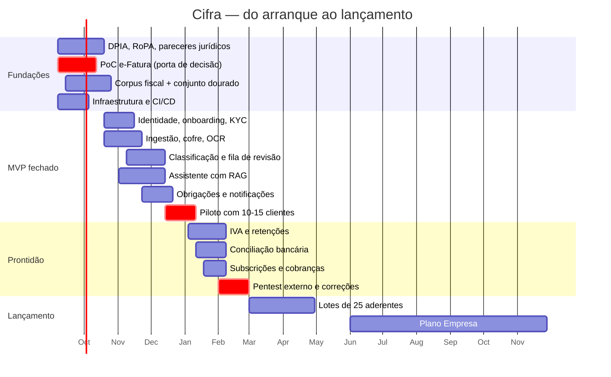

# 07 · Roadmap, equipa e custos

## 1. Restrição de partida

De setembro de 2026 ao lançamento no início de 2027 há **cerca de cinco meses úteis**.
Não chegam para tudo o que a página anuncia. O plano abaixo protege três coisas, por esta
ordem: **(1) conformidade legal**, **(2) o fluxo nuclear fatura → lançamento validado**,
**(3) a promessa de prazos**. Tudo o resto é negociável.

Um lançamento com o plano Start bem feito e o Pro em beta fechado é melhor do que três
planos meio feitos — sobretudo num negócio cujo produto é a confiança.

## 2. Fases

### Fase 0 · Fundações (set–out 2026, 6 semanas)

Trabalho que não produz ecrãs mas sem o qual não se pode lançar.

| Entrega | Responsável |
|---|---|
| **DPIA** e registo de atividades de tratamento (RoPA) | Sérgio + jurista |
| Política de privacidade, termos e condições, política de uso justo | Luís + jurista |
| Parecer jurídico sobre âmbito NIS2/DL 125/2025 e sobre AI Act | Jurista |
| Procedimento AML: identificação, recusa, conservação, formação | Carlos |
| **Prova de conceito da delegação e-Fatura** com 3 clientes reais | Sérgio + Carlos |
| Seleção do agregador PSD2 (cobertura, preço, DPA) | Sérgio |
| Seleção do parceiro de faturação certificada | Luís |
| Decisão de alojamento em região UE + DPAs assinados | Sérgio |
| Esqueleto da solução, CI/CD, MariaDB, ambientes, observabilidade | Sérgio |
| Corpus fiscal v1: 150 excertos aprovados para os 10 CAEs prioritários | Luís + Carlos |
| Conjunto dourado v1: 200 perguntas com resposta validada | Luís + Carlos |
| Consentimento e privacidade da lista de espera revistos | Sérgio |

> **Porta de saída da Fase 0.** Se a prova de conceito do e-Fatura falhar, o produto muda:
> passa a assentar em carregamento manual e SAF-T, o que altera a proposta de valor
> ("nem isso" deixa de ser verdade) e o preço. **Esta é a decisão mais importante do
> projeto e tem de ser tomada em outubro, não em janeiro.**

### Fase 1 · MVP fechado (out–dez 2026, 10 semanas)

Objetivo: 10–15 clientes reais da carteira do Luís e do Carlos a usar o produto a sério.

- Identidade e acesso, 2FA, perfis
- *Onboarding* com KYC e enquadramento fiscal
- Ingestão: e-Fatura (delegação), carregamento manual, email dedicado
- Cofre documental cifrado; OCR e extração
- Classificação por regras + IA, com confiança
- **Fila de revisão do CC** com aprovação em lote e atalhos de teclado
- Assistente com RAG, citações obrigatórias e triagem de risco em três níveis
- Motor de obrigações e notificações
- Portal do cliente (PWA) com os ecrãs descritos em [06 §2](06-frontend-ux.md#2-portal-do-cliente)
- Cadeia de auditoria e registo de IA
- Testes de isolamento multi-tenant em CI

**Não entra:** IVA, conciliação bancária, faturação, cobranças, plano Empresa.

### Fase 2 · Prontidão comercial (jan–fev 2027, 8 semanas)

- Declaração periódica de IVA e retenções na fonte (preparação e mapas; entrega pelo CC)
- Conciliação bancária via agregador PSD2, com fluxo de re-consentimento
- Subscrições e cobranças (SEPA + MB WAY), emissão das faturas da Cifra
- Integração com o parceiro de faturação
- Módulo de privacidade: exportação, apagamento parcial, gestão de consentimentos
- **Pentest externo** e correção de constatações altas e críticas
- Manuais de resposta a incidentes e primeiro exercício
- Restauro de cópia de segurança testado e cronometrado
- Migração dos clientes-piloto e correções resultantes

### Fase 3 · Lançamento (mar 2027)

- Abertura da lista de espera por ordem de inscrição, em lotes de 25
- Planos Start e Pro em produção
- Painel operacional: deflexão, tempo do CC, ligações partidas, prazos em risco
- Suporte de 1.ª linha com base de conhecimento

> **Lotes, não abertura geral.** A capacidade do CC é o limite físico do negócio. Abrir a
> todos ao mesmo tempo destrói a promessa de 24 h logo na primeira semana e, com ela, o
> ativo mais valioso da Cifra.

### Fase 4 · Consolidação e Empresa (abr–dez 2027)

- Aprendizagem das correções do CC (redução do tempo de revisão)
- Segundo CC e ferramentas de gestão de carteira
- Preparação do plano Empresa: IRC, IES, dossier fiscal, processamento salarial
- Preparação para certificação ISO/IEC 27001, se os clientes B2B a exigirem

## 3. Cronograma

## 4. Equipa

| Papel | Quem | Dedicação | Notas |
|---|---|---|---|
| Tecnologia / arquitetura | **Sérgio** | 100 % | Não pode ser simultaneamente arquiteto, developer único, DevOps e responsável de segurança |
| Developer .NET sénior | **a contratar** | 100 % | **Contratação crítica.** Sem ele o calendário não fecha |
| Front-end / UX | a contratar ou freelance | 50 % | Portal do cliente é onde se ganha ou perde a adesão |
| DevOps / segurança | freelance | 25 % | Infraestrutura, *hardening*, observabilidade, apoio ao pentest |
| Regras fiscais e conteúdo | **Luís** | 60 % | Dono do corpus, dos *prompts* e do conjunto dourado |
| Contabilista responsável | **Carlos** | 60 % → 100 % | Valida, define o fluxo de revisão, responde |
| Jurídico (RGPD/NIS2/AI Act) | externo | pontual | Fase 0 e revisão pré-lançamento |
| Pentest | externo | pontual | Fase 2 |
| Apoio de 1.ª linha | a contratar | 50 % a partir do lançamento | |

**A recomendação mais importante desta secção:** contratar o segundo developer em setembro.
É o único risco de calendário que não se pode mitigar com âmbito.

## 5. Custos indicativos

### Desenvolvimento (set 2026 – mar 2027, 7 meses)

| Rubrica | Estimativa |
|---|---|
| Developer .NET sénior (7 meses) | 28 000 – 38 500 € |
| Front-end/UX a 50 % (5 meses) | 10 000 – 15 000 € |
| DevOps/segurança a 25 % (5 meses) | 6 000 – 9 000 € |
| Jurídico (DPIA, pareceres, contratos) | 5 000 – 9 000 € |
| Pentest externo | 5 000 – 9 000 € |
| Licenças DevExpress (universal, 1 developer) | ~2 000 € |
| Infraestrutura e serviços em pré-produção | 2 500 – 4 000 € |
| Marca, conteúdo e materiais de lançamento | 3 000 – 6 000 € |
| **Total antes do lançamento** | **~62 000 – 92 500 €** |

Não inclui o tempo dos três sócios, que se assume como aporte.

### Operação recorrente (a 500 clientes)

| Rubrica | €/mês |
|---|---|
| Servidores de aplicação (2 nós) + réplicas | 120 – 250 |
| MariaDB (gerido ou 2 nós autogeridos) | 100 – 300 |
| Object storage + cópias de segurança fora do local | 40 – 90 |
| Observabilidade / SIEM | 50 – 150 |
| Inferência de IA + OCR | 250 – 600 |
| Agregador PSD2 (~200 contas ligadas) | 200 – 400 |
| Email, *push*, SMS | 40 – 90 |
| Pagamentos (~1,5 % do MRR) | ~380 |
| Cofre de segredos, WAF, certificados | 50 – 120 |
| **Total** | **~1 230 – 2 380 €/mês** |

Face a um MRR estimado de ~25 500 € a 500 clientes, o custo de infraestrutura fica em
5–9 % da receita. **O custo dominante continua a ser o tempo do CC**, o que confirma que o
esforço de engenharia deve concentrar-se na fila de revisão e na deflexão do assistente,
não em otimização de infraestrutura.

### Escolha de alojamento

| Opção | Custo | Carga operacional | Recomendação |
|---|---|---|---|
| Hetzner / OVHcloud (UE), Docker autogerido | Baixo | Alta | Escolha inicial, alinhada com a *stack* da equipa e com o orçamento |
| Azure West Europe, gerido | 2–3× | Baixa | Considerar quando houver clientes B2B com exigências de certificação |

Em qualquer caso: contrato com DPA, dados e cópias **exclusivamente na UE**, e verificação
de que o mesmo vale para o fornecedor do modelo de IA e para o OCR.

## 6. Indicadores a acompanhar desde o piloto

| Indicador | Alvo | Porquê |
|---|---|---|
| **Taxa de deflexão do assistente** | > 70 % | Determina se o preço fecha |
| Tempo médio do CC por lançamento | < 45 s | Determina a capacidade por CC |
| Exatidão do assistente (conjunto dourado) | > 95 % | Risco profissional |
| Taxa de correção pelo CC | < 15 % e a descer | Mede a aprendizagem do sistema |
| Sincronizações e-Fatura com sucesso | > 95 % | Sustenta a promessa "nem isso" |
| Obrigações cumpridas dentro do prazo | 100 % | É *a* promessa |
| Tempo até à primeira resposta do CC | < 24 h úteis | Compromisso comercial |
| Churn mensal | < 2 % | Viabilidade a médio prazo |
| Custo de IA por cliente/mês | < 1,20 € | Controlo de margem |
